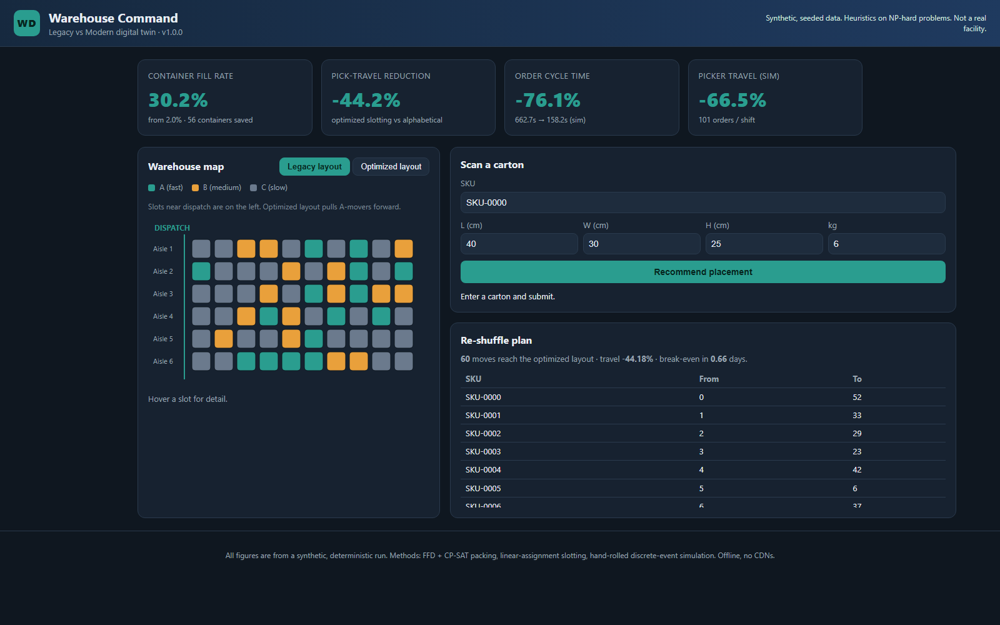

# Logistics Digital Twin

I built this to answer a very concrete warehouse question with numbers instead of opinions: **how
much does modern practice actually beat legacy practice** on the three things a distribution centre
lives and dies by — how full the outbound containers are, how far pickers walk, and how fast orders
get out the door?

So this is a small "digital twin" of a warehouse. It generates a synthetic facility (cartons with
sizes and ABC velocity classes, a rack layout with a dispatch distance per slot, and an order stream
over an 8-hour shift), then runs the same demand through two operating regimes and measures the gap:

- **Legacy** - arbitrary/alphabetical slotting, one carton per container, a single picker working
  orders one at a time with a round trip to dispatch for every line.
- **Modern** - velocity-based slotting, 3D bin-packing consolidation, and batched picking routes.



> **Everything here is synthetic and deterministic by default.** There is no real customer or
> facility data shipped anywhere - the numbers come from seeded generators (`seed=42`), so anyone
> who runs this gets the exact figures below. Bin packing and slotting are NP-hard; I use heuristics
> and report the measured optimality gap rather than claiming anything is provably optimal. The
> dashboard can also load *your own* SKU master from CSV (see "Load your own data" below) - the
> synthetic label then drops for the carton data, but the rack geometry and order stream stay
> seeded synthetic, and the UI says so.

## The app counterpart

This repo is the **analysis engine** of a two-repo pair: exact optimization (Hungarian-algorithm
slotting, a CP-SAT optimality proof on the small packing instance), discrete-event simulation, and
CSV import for real SKU catalogs. Its interactive sibling is
**[WarehouseTwin](https://github.com/Dimikissimov/logistics-flow-studio)** — the same warehouse
levers (slotting, ABC velocity, pick travel, push vs pull) as a hands-on, game-like PWA you can
play with in a browser. Use this engine for batch analysis and provable, reproducible numbers; use
the app for intuition, teaching, and quick what-ifs. The two now share a **layout interchange
format** ([`logitwin/layout.py`](logitwin/layout.py)): a floor designed in WarehouseTwin loads
straight into this engine for analysis, and writes back — see
[Layout interchange](#layout-interchange-warehousetwin-compatible) below.

## What the run measured

From my seeded run (`python -m logitwin --summary`):

| Metric | Legacy | Modern | Change |
| --- | --- | --- | --- |
| Container fill rate | 2.0% | 30.2% | consolidation from one carton/pallet to FFD |
| Containers used | 60 | 4 | **56 fewer** |
| Pick travel (slotting model) | baseline | optimized | **-44.2%** |
| Order cycle time (simulation) | 662.7 s | 158.0 s | **-76.2%** |
| Picker travel (simulation) | baseline | optimized | **-67.2%** |

Two honesty notes on those figures:

- The 2.0% "before" fill rate is literally one small carton sitting in a 120x80x100 cm pallet cage -
  that is what one-carton-per-container means, and it is exactly why consolidation matters. The
  after figure of 30.2% is a *shelf* heuristic, not a magic number; there is headroom left.
- On the small packing instance I check the heuristic against a CP-SAT exact solve: FFD-1D used **6
  bins and CP-SAT proved 6 is optimal - a 0% gap on that instance**. That is a genuinely good result
  on a small case, not a claim that FFD is optimal in general (it is not).

The re-slotting side also produces an executable plan: **36 SKUs move in 39 steps** (the other 24
SKUs stay put - the optimizer breaks ties among equally good layouts toward keeping SKUs in place,
verified to cost zero extra travel), breaking even in about **0.4 days** of saved picker time at the
stated assumptions (120 s per step, 1.2 m/s picker). The steps are in true execution order: the rack
is full, so the moves decompose into 3 cycles, each of which parks its first carton once in an
off-rack staging position ("STAGE") - every step lands in a spot that is empty at that moment, and
the staging position never holds more than one carton. Cycles run best-savings-first, and a what-if
slider on the dashboard shows how much of the 44% saving the first N steps capture if you only have
labour for a partial re-slot.

## How to run

```bash
pip install -r requirements.txt

# 1) the warehouse-command UI (offline, no CDNs)
python app.py            # -> http://localhost:5000

# 2) the executive deliverables (multi-page PDF + multi-sheet Excel in deliverables/)
python -m logitwin --deliverables

# 3) just the headline numbers on the console
python -m logitwin --summary

# 4) analyze a WarehouseTwin layout with the engine (see "Layout interchange" below)
python -m logitwin.layout --analyze examples/warehousetwin_layout.json

# 5) benchmark the packing engine against proven optima (see "Benchmark" below)
python -m logitwin.benchmark            # print the table
python -m logitwin.benchmark --json     # machine-readable

# 6) generate a WarehouseTwin-compatible plant layout (see "Plant generator" below)
python -m logitwin.generate --profile spare-parts-distribution --seed 42
python -m logitwin.generate --profile cold-chain --grid-w 48 --grid-h 28 --json

# 7) slotting / pick-travel sensitivity sweep (see "Slotting sensitivity" below)
python -m logitwin.sensitivity                      # print the frontier table + trade-off read
python -m logitwin.sensitivity --csv f.csv --svg f.svg   # write the deliverables
python -m logitwin.sensitivity --json               # machine-readable

# 8) containerised
docker compose up        # serves the app on port 5000 via gunicorn
```

Tests and lint:

```bash
python -m ruff check .
python -m pytest -q
```

> Note on port 5000: some Windows machines already run a service on 5000. If `python app.py` looks
> like it is serving someone else's page, another process holds the port - change the port in the
> `app.run(...)` call or free 5000.

## The UI

A single-page "warehouse command" dashboard, all hand-built and fully offline (inline SVG + vanilla
JS, no external libraries or fonts):

- a **warehouse map** you can flip between the legacy layout, the optimized layout, and a
  **"Changes" diff view** that outlines (dashed amber) every slot whose occupant differs between the
  two layouts and dims the rest - the weekend's physical scope at a glance, with a count line
  ("N of M slots change occupant"); slots are coloured by velocity class and the optimized view
  visibly pulls the A-movers toward dispatch;
- a **"scan a carton"** panel - give it dimensions, weight, and an SKU and it returns a recommended
  container/placement plus, if that SKU is due to move, the re-slot instruction (overweight or
  oversize cartons get no container recommendation, and unknown SKUs are flagged as such);
- **KPI tiles** for fill rate, travel reduction, and the simulation's cycle-time / travel deltas;
- a **re-shuffle plan** in execution order (every step lands in an empty spot; each cycle parks one
  carton in a "STAGE" position once), with human-readable Aisle-Bay-Level codes, click-a-row map
  highlighting, a CSV export of the step list, and a **what-if slider** that shows the share of the
  travel saving captured by executing only the first N steps;
- a **"Load your data"** panel that swaps the whole dashboard onto your own SKU catalog (below).

### Load your own data

The dashboard ships on synthetic SKUs, but a re-slot decision has to be made on *your* catalog. The
"Load your data" panel accepts:

- a **SKU master CSV** (required): `sku,length_cm,width_cm,height_cm,weight_kg[,velocity]` with
  velocity `A`/`B`/`C`, 8-500 rows, unique SKUs, positive dimensions;
- an **order-lines CSV** (optional): `sku[,qty]`, one row per pick line. When attached, velocity
  classes are derived from measured pick share (top 20% of SKUs = A, next 30% = B, rest = C - the
  same split the synthetic generator uses) and any velocity column in the master is ignored.

On import the same packing / slotting / simulation pipeline re-runs on your cartons, every KPI tile,
map, scan lookup, and the re-shuffle plan switch to your data, and the banner flips from "synthetic"
to naming your file. Stated honestly (and repeated in the UI as per-import assumptions):

- the **rack geometry stays synthetic** - a seeded 6-aisle layout sized to your SKU count; slot
  coordinates are not imported;
- the **simulation replays a seeded synthetic order stream** weighted by the velocity classes; your
  order timestamps are not replayed;
- **slotting demand uses the A/B/C class weights** (40/12/3 picks/day), the same model as the
  synthetic run, not per-SKU pick counts.

Files are analysed in memory only and never written to disk, and the exported plan CSV renames
itself `reshuffle-plan-imported.csv` so the two never get mixed up. "Reset to synthetic" restores
the seeded dataset. The CLI deliverables (`python -m logitwin --deliverables`) always describe the
synthetic run.

## Layout interchange (WarehouseTwin-compatible)

"One format, two tools." A warehouse floor **designed in the browser app
[WarehouseTwin](https://github.com/Dimikissimov/logistics-flow-studio)** can be loaded, validated,
and analysed by this engine — and written back — through
[`logitwin/layout.py`](logitwin/layout.py). The format is not invented here: it mirrors
WarehouseTwin's own `serialize()` / share-link JSON exactly (schema `wt-1`, a 1 m grid of
`{id, type, x, y, w, d}` elements with a `config.minAisleMetres`), so a share link or an exported
layout drops straight in.

```bash
python -m logitwin.layout --analyze examples/warehousetwin_layout.json
python -m logitwin.layout --analyze examples/warehousetwin_layout.json --slotting   # + seeded demo
python -m logitwin.layout --analyze examples/warehousetwin_layout.json --json        # machine-readable
```

Sample output on the bundled example (`examples/warehousetwin_layout.json`):

```
[analyze] WarehouseTwin layout (schema wt-1)
  grid: 20 x 12 cells @ 1.0 m/cell  (240.0 m^2 floor)
  elements: 6  (storage 2, flow 4; docks in=1 out=1)
  capacity: 58 pallet positions across 24.0 m^2 storage (10.0% of floor)
  aisle guard (min 2.9 m): 1 facing pair(s), 0 violation(s), narrowest 3.0 m
  pick travel to dock-out (rectilinear round-trip proxy): mean 14.0 m, min 10.0 m, max 18.0 m over 58 positions
```

Programmatic API: `load_layout(obj | json_str)` validates the layout (unknown fields/types, an
unsupported schema, out-of-bounds geometry and duplicate ids all raise `LayoutError`;
`reject_overlaps=True` adds an overlap check); `dump_layout(layout)` round-trips
(`load_layout(dump_layout(x)) == x`); `analyze_layout(layout)` returns the structured result above;
`layout_to_warehouse(layout)` maps the floor into the engine's `Warehouse` / `Slot` model; and
`load_share_link("#layout=…")` decodes a WarehouseTwin share link straight into the engine.

**Honest mapping** — the layout is a 2D floor plan and this engine's model is more abstract, so:

- **Maps faithfully** — footprint geometry (`x, y, w, d` in cells), the element-type vocabulary, and
  pallet **capacity** per storage element (the *identical* `elementCapacity` formula and half-up
  rounding as WarehouseTwin's `domain.js`), plus the aisle-width guard (`facingAislePairs` /
  `aisleViolations` against `minAisleMetres`).
- **Approximated** — **pick travel** is a rectilinear centroid-to-nearest-dock round-trip proxy (no
  aisle routing or rack entry points), consistent with the engine's own "round-trip proxy" distance
  model; storage positions become engine `Slot`s with synthetic aisle/bay/level indices and default
  slot cavity dims.
- **Dropped** — a layout carries **no SKU / demand data**, so a true slotting *optimization* cannot
  be computed from it. `--slotting` is an explicit demo that pairs the layout's real slot geometry
  with **seeded synthetic** cartons (and discloses it); its reduction % reflects that synthetic
  demand, not the layout. Material-flow connectivity and per-element attributes (selectivity,
  rotation, handling/cycle times, height, cost) are not consumed; `config` keys other than
  `minAisleMetres` are preserved for a loss-free round trip but not interpreted.

## Plant generator (WarehouseTwin-compatible)

The interchange runs both ways: as well as *analysing* a floor drawn in the app, the engine can
*generate* one. [`logitwin/generate.py`](logitwin/generate.py) is a procedural plant-layout
generator that, given a **plant profile** and a floor size, lays out docks, staging, compliant
racking zones and automation lanes and emits them in the same `wt-1` interchange — so a plant
generated here drops straight into WarehouseTwin, and RGV/conveyor lanes placed here round-trip
through both tools.

```bash
python -m logitwin.generate --list-profiles
python -m logitwin.generate --profile spare-parts-distribution --seed 42
python -m logitwin.generate --profile cold-chain --grid-w 48 --grid-h 28 --json   # emit the wt-1 layout
```

Four shared **plant profiles** (keys pinned to interoperate with the app):
`ecommerce-fulfilment`, `spare-parts-distribution`, `automotive-supply`, `cold-chain`. Each profile
is a set of **documented best-practice assumptions** — zone mix (which racking types, in what
proportion), minimum aisle width, dock count, a per-profile rack depth, and automation
(`conveyor` / `rgv` lanes). Sample summary:

```
[generate] plant layout 'spare-parts-distribution' (schema wt-1, seed 42)
  Spare-parts distribution centre: Very high SKU count, low units per line: ...
  grid: 40 x 24 cells @ 1.0 m/cell  (960.0 m^2 floor)
  docks: in=2 out=2  |  staging bands: 2
  zones (rack rows): carton-flow x2, mobile-racking x1, selective-racking x1
  transport lanes: conveyor x1 (transport, not storage -> 0 pallet positions)
  capacity: 676 pallet positions across 290.0 m^2 storage (30.2% of floor)
  aisle guard (min 2.2 m): 6 facing pair(s), 0 violation(s), narrowest 3.0 m
```

**RGV support** — the `rgv` element (a rail/rack-guided-vehicle lane) is a shared transport type:
it *moves* goods between zones, it does not *store* them, so it contributes **0 pallet positions**
(same rule as `conveyor` and every other non-storage element) while still validating and
round-tripping through the interchange.

**Honest scope** — the generator is a **deterministic rule/heuristic** (best-practice-informed),
**not a trained model** and not an optimiser: a given `(profile, grid, seed)` always yields a
byte-identical layout, and every result is re-validated (schema, in-bounds, overlap-free,
aisle-compliant) before it is returned. It reasons only about **2D footprint geometry** on a fixed
1 m grid, so it does **not** model real aisle routing/traffic or one-way flow, rack-internal
bay/level structure or true rack depths, SKUs/demand/throughput (no slotting or labour numbers),
building constraints (column grid, fire egress, sprinkler/ESFR, refrigeration zoning, floor-load
ratings, the yard), or multi-level mezzanines. The per-profile numbers are assumptions, not
measurements from a real site.

## Methods (and their honest limits)

- **3D bin-packing** (`logitwin/packing.py`) - First-Fit-Decreasing by volume with a shelf/layer
  placement rule that respects container dimensions and max weight. Bin packing is NP-hard, so this
  is a heuristic. I keep a CP-SAT exact solver (`ortools` CP-SAT) for a small 1D bin-count instance
  purely to measure how far FFD is from optimal on that case (0% on the checked instance; not a
  general guarantee).
- **Slotting** (`logitwin/slotting.py`) - assigning SKUs to slots to minimise demand-weighted travel
  is a balanced linear assignment problem, solved exactly with the Hungarian algorithm
  (`scipy.optimize.linear_sum_assignment`). Ties among equally good layouts are broken toward
  keeping SKUs in their current slot (an epsilon bias, verified against the unbiased optimum), and
  the re-shuffle is sequenced cycle-by-cycle so it is physically executable with one staging
  position. The optimum here is exact *for the one-SKU-per-slot model*; real slotting has capacity,
  family, and congestion constraints this model omits.
- **Discrete-event simulation** (`logitwin/simulate.py`) - hand-rolled with a `heapq` event queue
  (no SimPy). It is deterministic given the seed. The large cycle-time gap is partly a queueing
  effect: the legacy single-picker configuration runs close to capacity, so its wait times amplify
  the per-pick inefficiency - which is itself a real and relevant finding, not a modelling trick.
- **Slotting sensitivity** (`logitwin/sensitivity.py`) - a what-if layer that *reuses* the slotting
  optimizer and the simulation above (it introduces no new heuristic) to sweep how far to push a
  velocity re-slot and report the efficient frontier and its knee. See
  [Slotting sensitivity](#slotting-sensitivity-how-far-to-push-a-re-slot) below.

More detail and citations are in [`docs/METHODS.md`](docs/METHODS.md); the framing for a
non-technical reader is in [`docs/BUSINESS_CASE.md`](docs/BUSINESS_CASE.md).

## Benchmark: packing vs proven optima

A headline number is only worth as much as the yardstick behind it, so the packing engine is
benchmarked against a small set of **standard 1D bin-packing instances whose optimum is proven**,
and the gap is reported openly — **including the instances where the heuristic loses**. This is the
honest counterpart to the single "0% gap" check in the summary above.

Run it with `python -m logitwin.benchmark`. It calls the *real* engine — the First-Fit-Decreasing
heuristic (`ffd_min_bins_1d`) and the CP-SAT exact solver (`cpsat_min_bins`) from
[`logitwin/packing.py`](logitwin/packing.py) — on the instances committed in
[`data/benchmark_instances.json`](data/benchmark_instances.json):

| instance | engine (FFD heuristic) | engine (CP-SAT) | known/optimal | FFD gap | note |
| --- | --- | --- | --- | --- | --- |
| perfect-pairs-8 | 4 | 4 | 4 | 0 | FFD optimal |
| even-split-12 | 6 | 6 | 6 | 0 | FFD optimal |
| triplet-9 | 4 | 3 | 3 | **+1 (33.3%)** | FFD suboptimal |
| triplet-18 | 7 | 6 | 6 | **+1 (16.7%)** | FFD suboptimal |
| ffd-suboptimal-8 | 4 | 3 | 3 | **+1 (33.3%)** | FFD suboptimal |
| ffd-suboptimal-10 | 5 | 4 | 4 | **+1 (25.0%)** | FFD suboptimal |

**What this says, honestly:**

- **FFD is optimal on 2 of the 6 instances and suboptimal on 4** — on every triplet instance and on
  both dedicated traps it opens **one bin more than the optimum** (up to 33.3% more bins on the
  smallest cases). This is expected and is the point of the benchmark: bin packing is NP-hard and FFD
  is a heuristic, so it is *not* optimal in general. Its 1D worst-case bound is
  `FFD(I) <= (11/9)·OPT(I) + 6/9` (Dósa 2007) — about 22% above optimum in the worst case.
- **CP-SAT reaches the proven optimum on every instance.** The engine's exact solver earns its keep
  here; it is the reason the app can *measure* the heuristic's gap rather than guess it.
- The **triplet-\*** instances are Falkenauer's classic hard case for FFD (items grouped so three
  fill a bin exactly): greedily pairing two large items strands the third slot, which is exactly the
  failure the table shows.

**Where the instances (and their optima) come from** — cited per-instance in the JSON:

- **triplet-9 / triplet-18** — *constructed following Falkenauer's (1996) triplet-instance scheme*
  (each bin holds three items and is exactly full, so the optimum is `n/3`). The published instance
  files are distributed via **OR-Library** (Beasley 1990) and **BPPLIB** (Delorme, Iori & Martello
  2018); this benchmark runs fully offline and deterministically, so it reproduces the *scheme*
  rather than shipping a fetched copy of a specific file, and says so.
- **perfect-pairs-8 / even-split-12 / ffd-suboptimal-8 / ffd-suboptimal-10** — *hand-constructed*
  and labelled as such; the FFD-suboptimal pair is built to expose the heuristic's gap
  (cf. Johnson 1973; Dósa 2007).

Every optimum is **proven, not asserted**: for each instance the volume lower bound
`ceil(sum(items) / capacity)` equals the number of bins in an exhibited optimal packing (stored in
the JSON), so the known optimum is at once a valid lower bound and an achievable upper bound. The
loader (`logitwin.benchmark.validate_instance`) re-checks that proof on every run, and the test
suite pins the exact engine numbers above — the wins *and* the losses. Results are deterministic
(FFD is deterministic; CP-SAT proves optimality well inside its time limit, so the bin count does
not depend on wall-clock timing — runtimes are reported for information only).

## Slotting sensitivity: how far to push a re-slot

A full velocity re-slot lands a **-44.2%** pick-travel figure, but touching every SKU is rarely
worth it. This layer answers the operational follow-up honestly: **how much of that saving do you
capture if you only re-slot your top-X% fastest movers?** It sweeps one lever — the fraction of SKUs
(highest daily demand first) committed to the re-slot — and **reuses the existing engine unchanged**:
the Hungarian slotting optimizer (`logitwin/slotting.py`) re-slots the committed SKUs among the slots
they already occupy, and the discrete-event simulation (`logitwin/simulate.py`) reads throughput off
each resulting layout. Committing more SKUs can only lower travel, so travel-vs-effort is a genuine
efficient frontier, and the recommended point is its knee.

Run `python -m logitwin.sensitivity`. On the seeded 60-SKU synthetic facility (committed frontier
in [`docs/slotting_sensitivity.csv`](docs/slotting_sensitivity.csv), rendered in
[`docs/slotting_sensitivity.svg`](docs/slotting_sensitivity.svg); `python -m logitwin --deliverables`
also drops a copy in the generated `deliverables/` bundle):

| SKUs committed | moves | pick travel (unit-m/day) | travel reduction | golden-zone A-occupancy | mean cycle time |
| --- | --- | --- | --- | --- | --- |
| 0 (legacy) | 0 | 29,423.9 | 0.0% | 25% | 244.2 s |
| 12 (top 20%) | 0 | 29,423.9 | 0.0% | 25% | 244.2 s |
| 18 (top 30%) | 6 | 25,691.8 | 12.7% | 50% | 211.6 s |
| 24 (top 40%) | 16 | 23,230.6 | 21.1% | 50% | 194.4 s |
| 36 (top 60%) | 24 | 17,876.6 | 39.2% | 100% | 162.6 s |
| **42 (top 70%)** | **33** | **16,563.5** | **43.7%** | **100%** | **154.1 s** |
| 60 (all) | 36 | 16,423.5 | 44.2% | 100% | 158.0 s |

**The trade-off read, straight from the code:** committing the **top 42 of 60 SKUs (33 moves)
captures 43.7% pick-travel reduction — over 90% of the full re-slot's 44.2%**. Going all the way to
100% adds only 3 more moves for the last 0.5 of a point. Across that push, golden-zone A-mover
occupancy rises **25% → 100%** and mean order cycle time falls **244 s → 158 s**. The recommended
operating point is therefore the **top 70% cutoff** — near-all of the benefit at ~90% of the effort.

**Honest notes:**

- The first two rows (up to the top 20%) show **0 moves and 0% saving**: those SKUs are all one
  velocity class (A), so shuffling equal-demand SKUs among a fixed set of slots buys no travel — the
  saving only starts once the committed set spans more than one demand level. That is reported, not
  hidden.
- **Throughput here is responsiveness, not completion rate.** Because the sweep holds batched picking
  fixed and only varies slotting, the single picker stays under-loaded, so *orders completed per
  hour* is arrival-bound and barely moves; slotting shows up as **mean cycle time** (−35% across the
  sweep) and simulated **picker travel** (11,281 m → 6,815 m), which is what the table and the CSV
  track. This mirrors the queueing note in Methods below.
- All figures are **synthetic, seeded and deterministic** (the CSV and SVG are byte-identical across
  re-runs), teaching-scale, and reported exactly as the code produces them. The slotting optimum is
  exact only for the one-SKU-per-slot model; real slotting adds capacity, family and congestion
  constraints this omits. This lever is distinct from the dashboard's what-if slider (which executes
  a growing prefix of the *full* plan's move sequence); both bottom out at the same optimum.

## Illustrative public case studies

Two well-known operators are sometimes cited as reference points for warehouse modernisation. I
mention them only as **illustrative, public-information** context - I am **not affiliated with either
company, have no internal data, and invent no internal figures**:

- **Würth** - a global distributor of fasteners and MRO supplies whose business depends heavily on
  fast, accurate small-parts picking across a very large SKU base; public materials describe ongoing
  logistics-automation investment.
- **Schwarz Group (Lidl / Kaufland)** - a large European retailer whose regional distribution
  centres are a standard public example of high-throughput warehouse operations.

These are context for *why* the levers modelled here (slotting, consolidation, batching) matter at
scale, not claims about those companies' internal numbers.

## Stack

Python 3.14 locally (3.12 in Docker/CI for OR-Tools wheels), NumPy, SciPy, OR-Tools (CP-SAT),
Matplotlib, Flask/Jinja2, openpyxl, pandas. No SimPy - the simulation is a plain `heapq` event loop.

## License

© 2026 Dimitres Kisimov — all rights reserved; published for portfolio review. See LICENSE. All code, data generators, and graphics are original - see
[`CREDITS.md`](CREDITS.md).
